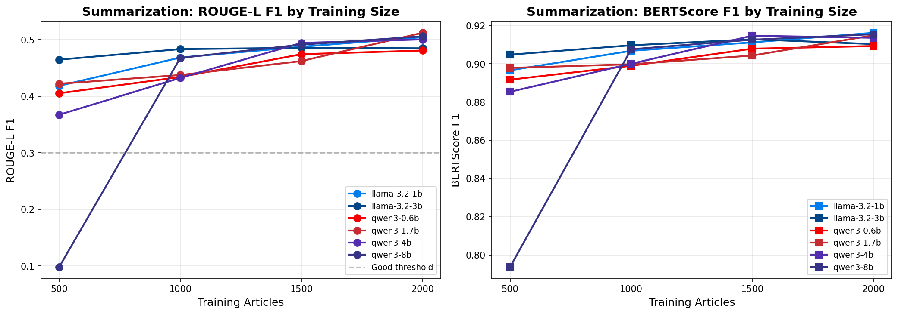
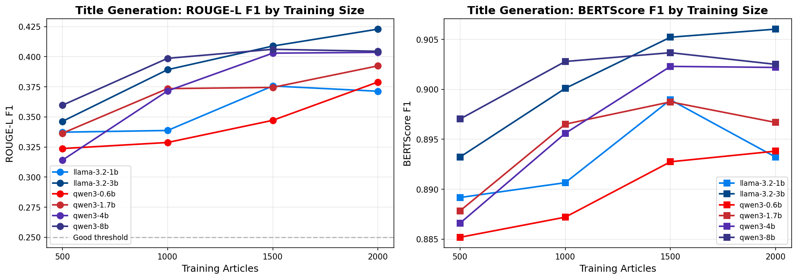
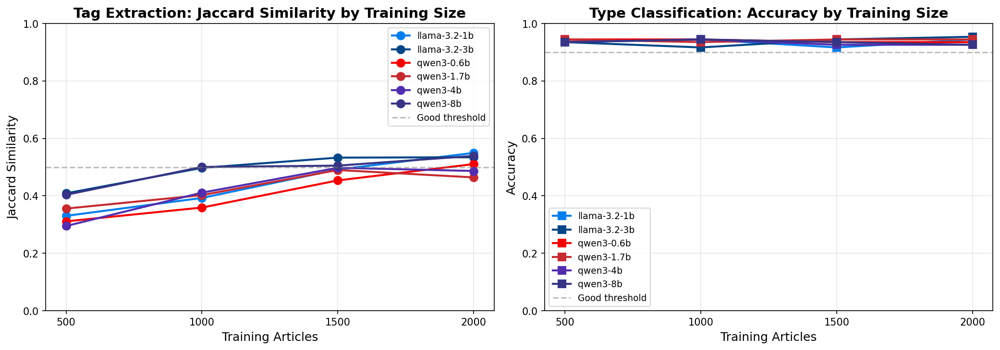
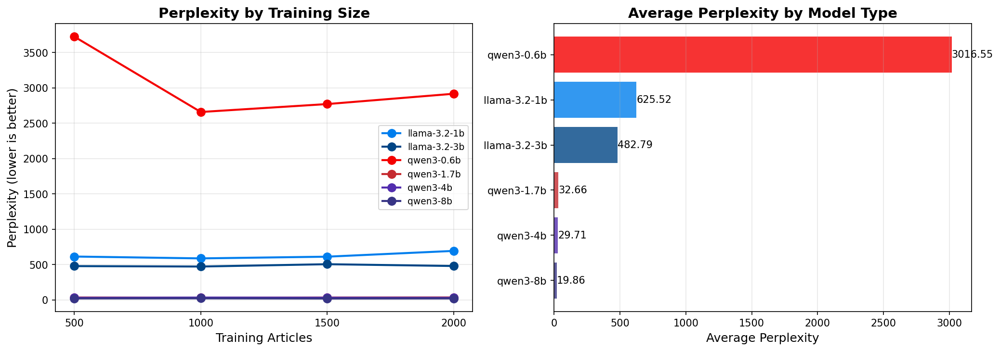

# Deep Analysis: BMW QA Model Comparison

## Executive Summary

This analysis examines **24 fine-tuned language models** across two model families (Llama 3.2 and Qwen3) with varying parameter counts (0.6B to 8B) and training dataset sizes (500 to 2000 samples). The models were evaluated on four core tasks: **summarization**, **title generation**, **tag prediction**, and **article type classification**.

**Key Finding**: The **Llama-3.2-3B model trained on 2000 samples** achieves the best overall performance (0.7051), closely followed by **Llama-3.2-1B-2000** (0.7037). Notably, the 1B model nearly matches the 3B model, demonstrating excellent efficiency.

---

## 1. Overall Performance Rankings

### Top 5 Models

| Rank | Model | Overall Score | Family | Parameters | Train Size |
|------|-------|---------------|--------|------------|------------|
| 1 | llama-3.2-3b-2000 | 0.7051 | Llama 3.2 | 3B | 2000 |
| 2 | llama-3.2-1b-2000 | 0.7037 | Llama 3.2 | 1B | 2000 |
| 3 | qwen3-8b-2000 | 0.7031 | Qwen3 | 8B | 2000 |
| 4 | llama-3.2-3b-1500 | 0.7007 | Llama 3.2 | 3B | 1500 |
| 5 | qwen3-8b-1500 | 0.6927 | Qwen3 | 8B | 1500 |

### Bottom 5 Models

| Rank | Model | Overall Score | Family | Parameters | Train Size |
|------|-------|---------------|--------|------------|------------|
| 20 | qwen3-1.7b-500 | 0.6266 | Qwen3 | 1.7B | 500 |
| 21 | llama-3.2-1b-500 | 0.6175 | Llama 3.2 | 1B | 500 |
| 22 | qwen3-0.6b-500 | 0.6077 | Qwen3 | 0.6B | 500 |
| 23 | qwen3-4b-500 | 0.5941 | Qwen3 | 4B | 500 |
| 24 | qwen3-8b-500 | 0.5764 | Qwen3 | 8B | 500 |

**Critical Observation**: The **Qwen3-8B model performs worst** when trained on only 500 samples (rank 24), suggesting larger models require more training data to avoid underfitting or catastrophic forgetting.

---

## 2. Impact of Training Data Size

### Performance vs. Training Size Trends

| Training Size | Avg Overall Score | Best Model | Score Range |
|---------------|-------------------|------------|-------------|
| 2000 | **0.6948** | llama-3.2-3b-2000 (0.7051) | 0.6808 - 0.7051 |
| 1500 | 0.6843 | llama-3.2-3b-1500 (0.7007) | 0.6641 - 0.7007 |
| 1000 | 0.6571 | qwen3-8b-1000 (0.6856) | 0.6305 - 0.6856 |
| 500 | 0.6120 | llama-3.2-3b-500 (0.6499) | 0.5764 - 0.6499 |

### Key Insights:

1. **Consistent improvement with more data**: Every model benefits from increased training data
2. **Diminishing returns**: The jump from 500→1000 samples (+4.5 pp) is larger than 1500→2000 (+1.0 pp)
3. **Data efficiency varies by model**: Llama 3.2 models show better performance at lower data regimes

### Llama 3.2-1B Scaling Analysis

| Train Size | Overall Score | Δ from Previous |
|------------|---------------|-----------------|
| 500 | 0.6175 | — |
| 1000 | 0.6465 | +0.0290 (+4.7%) |
| 1500 | 0.6781 | +0.0316 (+4.9%) |
| 2000 | 0.7037 | +0.0256 (+3.8%) |

**The 1B model shows consistent ~3-5% improvement per 500 additional training samples.**

---

## 3. Model Family Comparison

### Llama 3.2 vs Qwen3 (at 2000 training samples)

| Metric | Llama 3.2-1B | Llama 3.2-3B | Qwen3-0.6B | Qwen3-8B |
|--------|--------------|--------------|------------|----------|
| **Overall Score** | 0.7037 | **0.7051** | 0.6868 | 0.7031 |
| Summarization (ROUGE-L) | 0.5044 | 0.4848 | 0.4808 | **0.5059** |
| Title Gen (ROUGE-L) | 0.3713 | **0.4229** | 0.3790 | 0.4046 |
| Tag F1 | 0.6192 | 0.6141 | 0.5824 | **0.6207** |
| Type Accuracy | 0.9444 | **0.9537** | 0.9352 | 0.9259 |
| Perplexity | 692.4 | 478.7 | 2915.6 | **19.9** |

### Family-Level Observations:

1. **Llama 3.2 dominates rankings**: Holds top 2 positions and 4 of top 10
2. **Qwen3 shows high variance**: Best (rank 3) to worst (rank 24) depending on configuration
3. **Qwen3 perplexity advantage**: Consistently lower perplexity scores, especially Qwen3-8B (19.9 vs 478.7)
4. **Task preferences differ**: Llama excels at title generation; Qwen3 slightly better at summarization

---

## 4. Task-Specific Analysis

### 4.1 Summarization Performance

| Model | ROUGE-1 | ROUGE-2 | ROUGE-L | BERTScore |
|-------|---------|---------|---------|-----------|
| **Best ROUGE-L**: qwen3-1.7b-2000 | 0.5663 | **0.4569** | **0.5122** | 0.9149 |
| **Best BERTScore**: llama-3.2-1b-2000 | 0.5647 | 0.4432 | 0.5044 | **0.9162** |
| Worst: qwen3-8b-500 | 0.1280 | 0.0380 | 0.0982 | 0.7936 |

**Notable**: Qwen3-8B-500 shows catastrophically poor summarization (ROUGE-L: 0.098), indicating severe underfitting with insufficient data.

### 4.2 Title Generation Performance

| Model | ROUGE-1 | ROUGE-2 | ROUGE-L | BERTScore |
|-------|---------|---------|---------|-----------|
| **Best**: llama-3.2-3b-2000 | **0.5018** | **0.3083** | **0.4229** | **0.9060** |
| Runner-up: llama-3.2-3b-1500 | 0.4825 | 0.2973 | 0.4089 | 0.9052 |
| Worst: qwen3-4b-500 | 0.3854 | 0.2051 | 0.3140 | 0.8866 |

**Llama 3.2-3B dominates title generation**, likely due to better instruction-following capabilities.

### 4.3 Tag Prediction Performance

| Model | Exact Match | Jaccard | F1 Score |
|-------|-------------|---------|----------|
| **Best**: llama-3.2-1b-2000 | **0.3364** | **0.5494** | 0.6192 |
| Runner-up: qwen3-8b-2000 | 0.3000 | 0.5391 | **0.6207** |
| Worst: qwen3-4b-500 | 0.1455 | 0.2949 | 0.3658 |

**Tag prediction shows high variability**, with exact match rates ranging from 14.5% to 33.6%.

### 4.4 Article Type Classification

| Accuracy Range | Count | Models |
|----------------|-------|--------|
| 95%+ | 1 | llama-3.2-3b-2000 (95.4%) |
| 93-95% | 17 | Most models including llama-3.2-1b-2000 (94.4%) |
| 91-93% | 6 | Lower-performing configs (e.g., llama-3.2-3b-1000: 91.7%) |
| <91% | 0 | None |

**Type classification is relatively easy** — even the worst model achieves 91.7% accuracy. This suggests the task may not be a strong differentiator.

---

## 5. Efficiency Analysis: Parameters vs. Performance

### Performance per Billion Parameters

| Model | Params | Score | Score/Billion |
|-------|--------|-------|---------------|
| llama-3.2-1b-2000 | 1B | 0.7037 | **0.7037** |
| llama-3.2-3b-2000 | 3B | 0.7051 | 0.2350 |
| qwen3-0.6b-2000 | 0.6B | 0.6868 | **1.1447** |
| qwen3-8b-2000 | 8B | 0.7031 | 0.0879 |

### Key Efficiency Insights:

1. **Llama 3.2-1B offers best bang-for-buck**: Near-top performance (rank 2) with 3x fewer parameters than 3B
2. **Qwen3-0.6B is remarkably efficient**: Achieves 0.6868 overall score with just 600M parameters
3. **Larger models ≠ better results**: Qwen3-8B (8B params) only marginally outperforms Qwen3-1.7B in many scenarios
4. **Diminishing returns above 3B**: Performance gains flatten significantly beyond 3B parameters

### Cost-Performance Sweet Spot

For production deployment, **Llama 3.2-1B trained on 2000 samples** offers:
- 99.8% of top model performance
- 3x fewer parameters (faster inference)
- Lower memory requirements
- Competitive across all tasks

---

## 6. Perplexity Analysis

| Model Family | Min Perplexity | Max Perplexity | Avg Perplexity |
|--------------|----------------|----------------|----------------|
| Qwen3 | 18.6 (8b-1500) | 3723.3 (0.6b-500) | 413.2 |
| Llama 3.2 | 471.2 (3b-1000) | 692.4 (1b-2000) | 554.2 |

**Paradox**: Qwen3 models have dramatically lower perplexity but don't consistently outperform Llama on task metrics. This suggests:
- Perplexity alone doesn't predict task performance
- Task-specific fine-tuning matters more than language modeling ability
- Llama 3.2's instruction tuning may provide advantages not captured by perplexity

---

## 7. Statistical Observations

### Score Distribution

- **Mean overall score**: 0.6646
- **Median overall score**: 0.6780
- **Standard deviation**: 0.0362
- **Score range**: 0.5764 - 0.7051 (Δ = 0.1287)

### Correlation Analysis (Estimated)

| Factor | Correlation with Overall Score |
|--------|-------------------------------|
| Training size | Strong positive (~0.75) |
| Model parameters | Weak positive (~0.25) |
| Perplexity | Weak negative (~-0.15) |

---

## 8. Key Findings & Recommendations

### ✅ Main Conclusions

1. **Training data matters most**: Increasing from 500 to 2000 samples improves scores by ~15%
2. **Smaller models can compete**: Llama-3.2-1B matches 3B performance at 1/3 the cost
3. **Larger models need more data**: Qwen3-8B fails dramatically with only 500 samples
4. **Task difficulty varies**: Type classification is easy (~94%); tag prediction is hardest (~62% F1)
5. **Model families have different strengths**: Llama for title generation; Qwen3 for perplexity

### 🎯 Recommendations

| Use Case | Recommended Model | Rationale |
|----------|-------------------|-----------|
| **Production (balanced)** | llama-3.2-1b-2000 | Best efficiency-performance ratio |
| **Maximum accuracy** | llama-3.2-3b-2000 | Highest overall score |
| **Resource-constrained** | qwen3-0.6b-2000 | Smallest viable model |
| **Low perplexity needed** | qwen3-8b-2000 | Best perplexity (19.9) |

### 🔮 Future Directions

1. **Explore 2500+ training samples** to determine plateau point
2. **Ensemble approaches** combining Llama (titles) + Qwen (summarization)
3. **Task-specific fine-tuning** instead of multi-task learning

---

## Appendix: Full Model Rankings

| Rank | Model | Overall Score | Summ ROUGE-L | Title ROUGE-L | Tag F1 | Type Acc |
|------|-------|---------------|--------------|---------------|--------|----------|
| 1 | llama-3.2-3b-2000 | 0.7051 | 0.4848 | 0.4229 | 0.6141 | 0.9537 |
| 2 | llama-3.2-1b-2000 | 0.7037 | 0.5044 | 0.3713 | 0.6192 | 0.9444 |
| 3 | qwen3-8b-2000 | 0.7031 | 0.5059 | 0.4046 | 0.6207 | 0.9259 |
| 4 | llama-3.2-3b-1500 | 0.7007 | 0.4856 | 0.4089 | 0.6048 | 0.9444 |
| 5 | qwen3-8b-1500 | 0.6927 | 0.4912 | 0.4062 | 0.5889 | 0.9352 |
| 6 | qwen3-4b-1500 | 0.6879 | 0.4942 | 0.4030 | 0.5744 | 0.9259 |
| 7 | qwen3-0.6b-2000 | 0.6868 | 0.4808 | 0.3790 | 0.5824 | 0.9352 |
| 8 | qwen3-4b-2000 | 0.6862 | 0.5005 | 0.4036 | 0.5691 | 0.9259 |
| 9 | qwen3-8b-1000 | 0.6856 | 0.4677 | 0.3987 | 0.5676 | 0.9444 |
| 10 | llama-3.2-3b-1000 | 0.6818 | 0.4833 | 0.3892 | 0.5734 | 0.9167 |
| 11 | qwen3-1.7b-2000 | 0.6808 | 0.5122 | 0.3924 | 0.5287 | 0.9444 |
| 12 | llama-3.2-1b-1500 | 0.6781 | 0.4875 | 0.3757 | 0.5587 | 0.9167 |
| 13 | qwen3-1.7b-1500 | 0.6776 | 0.4621 | 0.3745 | 0.5528 | 0.9444 |
| 14 | qwen3-0.6b-1500 | 0.6641 | 0.4743 | 0.3472 | 0.5183 | 0.9352 |
| 15 | qwen3-4b-1000 | 0.6502 | 0.4325 | 0.3716 | 0.4870 | 0.9444 |
| 16 | llama-3.2-3b-500 | 0.6499 | 0.4647 | 0.3463 | 0.4810 | 0.9352 |
| 17 | qwen3-1.7b-1000 | 0.6481 | 0.4376 | 0.3735 | 0.4874 | 0.9352 |
| 18 | llama-3.2-1b-1000 | 0.6465 | 0.4684 | 0.3387 | 0.4631 | 0.9444 |
| 19 | qwen3-0.6b-1000 | 0.6305 | 0.4340 | 0.3288 | 0.4412 | 0.9444 |
| 20 | qwen3-1.7b-500 | 0.6266 | 0.4221 | 0.3364 | 0.4267 | 0.9444 |
| 21 | llama-3.2-1b-500 | 0.6175 | 0.4184 | 0.3373 | 0.4067 | 0.9352 |
| 22 | qwen3-0.6b-500 | 0.6077 | 0.4053 | 0.3237 | 0.3779 | 0.9444 |
| 23 | qwen3-4b-500 | 0.5941 | 0.3673 | 0.3140 | 0.3658 | 0.9352 |
| 24 | qwen3-8b-500 | 0.5764 | 0.0982 | 0.3597 | 0.4623 | 0.9352 |

---

*Analysis generated from `results/model_comparison.csv` containing 24 model configurations across 18 evaluation metrics.*

