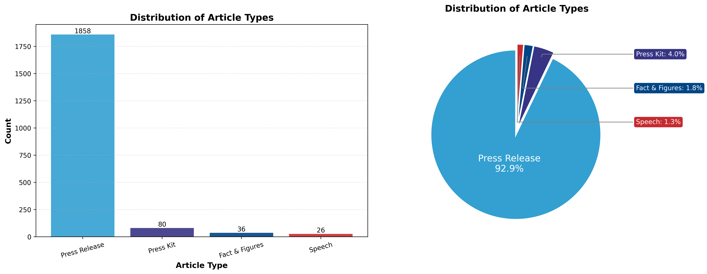
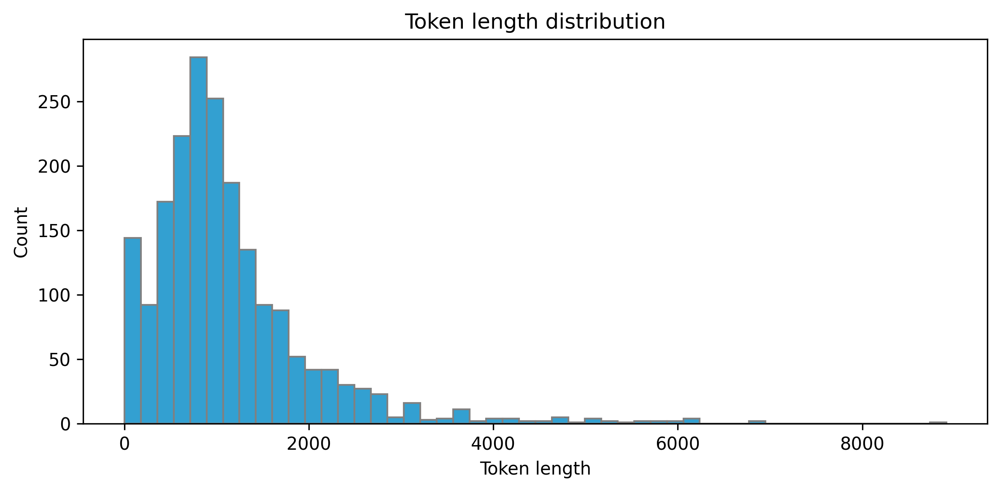

# ChatBMW Design Choices

This document explains the key design decisions made throughout the ChatBMW pipeline, from data collection to model deployment.

---

## Table of Contents
1. [Scraping](#1-scraping)
2. [Data Processing](#2-data-processing)
3. [Model Fine-Tuning with Unsloth/LoRA](#3-model-fine-tuning-with-unslothlora)
4. [Evaluation](#4-evaluation)
5. [Deployment](#5-deployment)

---

## 1. Scraping

### 1.1 Target Source: BMW PressClub

**Choice:** Scrape from [BMW PressClub Global](https://www.press.bmwgroup.com/global/article)

**Rationale:**
- Official, authoritative source for BMW news and press releases
- Well-structured HTML with consistent semantic markup
- Rich metadata: article types, tags, dates, and full content
- Pagination support for systematic collection

### 1.2 Rate Limiting & Politeness

```yaml
scraper:
  delay: 1.5          # Seconds between requests
  timeout: 30.0       # HTTP request timeout
  max_retries: 3      # Retry attempts for failed requests
```

**Choices:**
- **1.5s delay**: Balances collection speed with server politeness; prevents IP blocking
- **30s timeout**: Accommodates slow responses without hanging indefinitely
- **3 retries**: Handles transient network issues without infinite loops

### 1.3 Data Collection Strategy

**Choice:** Paginated scraping with 20% buffer

**Rationale:**
- BMW PressClub uses `?page=N` pagination (~20 articles/page)
- Collect 20% extra articles to account for filtering losses
- Track seen URLs to prevent duplicates across pages

### 1.4 Content Fetching

**Choice:** Optional two-phase collection (listing + detail)

```yaml
fetch_details: True  # Default: fetch full content (for training)
```

**Rationale:**
- **Listing-only mode**: Fast metadata collection for exploration
- **Detail mode**: Fetches full article content for training data
- Allows users to choose speed vs. completeness

### 1.5 HTML Parsing

**Choice:** BeautifulSoup with lxml parser

**Rationale:**
- lxml: Fastest parser for large HTML documents
- Multiple fallback strategies for robust extraction:
  1. Primary: `<article class="newsfeed">` elements
  2. Fallback: Links containing `/article/detail/`
- Handles BMW PressClub's specific HTML structure:
  - Title: `<h3><a href="...">`
  - Summary: `<p class="serif">`
  - Tags: `<div class="tagging-info">`
  - Type: `<span class="category">`

### 1.6 Output Formats

**Choice:** Both JSON and JSONL formats

```yaml
output:
  format:
    - "json"   # Human-readable, good for inspection
    - "jsonl"  # Machine-friendly, streaming-compatible
```

**Rationale:**
- JSON: Easy to inspect, includes metadata wrapper
- JSONL: Line-by-line processing, memory-efficient for large datasets

---

## 2. Data Processing

### 2.1 Data Cleaning

**Choice:** Aggressive removal of non-training content

**Removed elements:**
- URLs (http/https/www patterns)
- Social media links (Facebook, Instagram, YouTube, etc.)
- Phone numbers and email addresses
- Boilerplate text (contact sections, company descriptions)

**Rationale:**
- URLs and contact info don't contribute to language understanding
- Reduces noise that could distract the model during training
- Smaller token count = faster training

### 2.2 Multi-Task Training Format

**Choice:** Generate 4 distinct tasks per article

| Task | Input | Output |
|------|-------|--------|
| Summarization | Article content | Summary |
| Title Generation | Summary + content | Title |
| Tag Extraction | Summary + content | Comma-separated tags |
| Type Classification | Summary + content | Article type |

**Rationale:**
- Multiple tasks per article maximize data utility
- Different tasks exercise different model capabilities
- Classification tasks help model learn BMW's content taxonomy

### 2.3 Chat Template Format

**Choice:** System/User/Assistant message structure

```json
{
  "messages": [
    {"role": "system", "content": "You are an expert at..."},
    {"role": "user", "content": "Instruction + Article content"},
    {"role": "assistant", "content": "Expected output"}
  ]
}
```

**Rationale:**
- Compatible with Llama-3.2's instruction format
- System prompts provide task-specific context
- Standard chat format enables conversation-style inference

### 2.4 Article Type Exclusion

**Choice:** Exclude "Fact & Figures" articles by default

**Rationale:**
- These articles are primarily tabular/numerical data
- Poor training signal for language generation tasks
- Other types (Press Release, Press Kit, Speech) have richer narrative content

**Dataset Composition:**



The scraped dataset is dominated by Press Releases (92.9%), with smaller contributions from Press Kits (4.0%), Fact & Figures (1.8%), and Speeches (1.3%).

### 2.5 Dataset Splitting

**Choice:** Stratified 80/10/10 split by article type

```python
test_size: 0.1   # 10% for testing
val_size: 0.1    # 10% for validation
```

**Rationale:**
- Stratified split ensures type distribution is consistent across splits
- Falls back to random split if any class has too few samples
- 80/10/10 is standard for moderate dataset sizes
- Seed=42 for reproducibility

---

## 3. Model Fine-Tuning with Unsloth/LoRA

### 3.1 Base Model Selection

**Choice:** `unsloth/Llama-3.2-1B-Instruct`

**Rationale:**
- **1B parameters**: Small enough for efficient fine-tuning on consumer GPUs
- **Instruct variant**: Pre-trained for instruction following
- **Unsloth optimization**: 2x faster training with 50% less memory
- **Llama-3.2 architecture**: Strong baseline performance

### 3.2 LoRA Configuration

```yaml
lora:
  r: 32                    # Rank of adaptation matrices
  lora_alpha: 16           # Scaling factor
  lora_dropout: 0          # No dropout (optimized)
  target_modules:
    - q_proj, k_proj, v_proj, o_proj  # Attention layers
    - gate_proj, up_proj, down_proj    # MLP layers
```

**Choices explained:**

| Parameter | Value | Rationale |
|-----------|-------|-----------|
| `r=32` | Medium rank | Balance between expressiveness and parameter efficiency |
| `lora_alpha=16` | Standard scaling | Controls magnitude of LoRA updates |
| `lora_dropout=0` | Optimized for Unsloth | Unsloth optimizes for zero dropout |
| `target_modules` | All linear layers | Maximum adaptation capacity |
| `bias="none"` | No bias training | Reduces parameters, often sufficient |

### 3.3 Training Hyperparameters

```yaml
training:
  per_device_train_batch_size: 8
  gradient_accumulation_steps: 1
  learning_rate: 2.0e-4
  num_train_epochs: 20
  warmup_steps: 10
  lr_scheduler_type: linear
  optim: adamw_8bit
  weight_decay: 0.001
```

**Key decisions:**

| Choice | Rationale |
|--------|-----------|
| `batch_size=8` | Fits on most GPUs with 4096 context length |
| `lr=2e-4` | Standard for LoRA fine-tuning |
| `20 epochs` | Allows convergence; early stopping prevents overfit |
| `linear scheduler` | Gradual decay to stable loss |
| `adamw_8bit` | Memory-efficient optimizer |

### 3.4 Response-Only Training

**Choice:** Train only on assistant responses using Unsloth's `train_on_responses_only`

```yaml
response_training:
  instruction_part: "<|start_header_id|>user<|end_header_id|>\n\n"
  response_part: "<|start_header_id|>assistant<|end_header_id|>\n\n"
```

**Rationale:**
- Loss computed only on model outputs, not input prompts
- Prevents model from memorizing instructions
- More efficient gradient updates
- Aligns training objective with inference task

### 3.5 Early Stopping

```yaml
early_stopping:
  patience: 10             # Steps without improvement
  threshold: 0.0           # Minimum improvement required
```

**Rationale:**
- Prevents overfitting when validation loss plateaus
- Patience=10 allows brief stagnation before stopping
- Saves best model based on `eval_loss`

### 3.6 Sequence Length Handling

**Choice:** `max_seq_length: 4096` with filtering

**Rationale:**
- Llama-3.2 supports up to 128K context, but 4096 is memory-efficient
- Filter samples where assistant response would be truncated
- Prevents NaN losses from all-masked labels

**Token Length Distribution:**



Most articles fall within 500-2000 tokens, with a peak around 1000 tokens. The long tail extends to ~8000 tokens, justifying the 4096 max sequence length choice which covers the majority of samples while remaining memory-efficient.

### 3.7 Model Saving

**Choice:** Save both LoRA adapters and merged 16-bit model

```yaml
save:
  merged_save_method: "merged_16bit"
```

**Rationale:**
- **LoRA adapters**: Small files (~65MB), can be applied to any Llama-3.2
- **Merged model**: Ready-to-use, no adapter loading needed
- **16-bit precision**: Good quality/size tradeoff for deployment

---

## 4. Evaluation

### 4.1 Task-Specific Metrics

**Choice:** Different metrics for different task types

| Task | Primary Metrics | Rationale |
|------|-----------------|-----------|
| Summarization | ROUGE-L, BERTScore | Capture content overlap and semantic similarity |
| Title Generation | ROUGE-1, BERTScore | Short text; unigram overlap matters |
| Tag Extraction | Jaccard, F1 | Set-based comparison for multi-label |
| Type Classification | Accuracy | Single correct answer |

### 4.2 Text Generation Metrics

**ROUGE Scores:**
- ROUGE-1: Unigram overlap (surface-level similarity)
- ROUGE-2: Bigram overlap (phrase matching)
- ROUGE-L: Longest common subsequence (structure)

**BERTScore:**
- Semantic similarity using contextual embeddings
- Captures paraphrases and synonyms
- Slower but more meaningful than n-gram metrics

### 4.3 Perplexity Computation

**Choice:** Compute perplexity on expected outputs

```python
perplexity = exp(average_negative_log_likelihood)
```

**Rationale:**
- Model-intrinsic metric (no reference comparison)
- Lower = better language modeling
- Measures fluency and coherence
- Requires model access (computed during full evaluation)

### 4.4 Quality Thresholds

**Choice:** Defined quality tiers for automated assessment

```python
QUALITY_THRESHOLDS = {
    "summarization": {"good": 0.30, "acceptable": 0.20},  # ROUGE-L
    "title_generation": {"good": 0.25, "acceptable": 0.15},  # ROUGE-1
    "tag_extraction": {"good": 0.60, "acceptable": 0.40},  # F1
    "type_classification": {"good": 0.90, "acceptable": 0.80},  # Accuracy
}
```

**Rationale:**
- Title generation has lower thresholds (creative variation acceptable)
- Classification expects high accuracy (limited label set)
- Thresholds based on typical LLM performance ranges

### 4.5 Evaluation Workflow

**Choice:** Two evaluation modes

1. **Results-file mode**: Load pre-generated outputs, compute metrics
2. **Full mode**: Run inference + compute metrics + save results

**Rationale:**
- Results-file mode enables rapid metric iteration
- Full mode provides end-to-end validation
- Perplexity only computed when model is loaded

---

## 5. Deployment

### 5.1 Model Repository

**Choice:** Hugging Face Hub

**Rationale:**
- Industry standard for model sharing
- Built-in versioning and model cards
- Easy integration with transformers/inference APIs
- Community discovery and citations

### 5.2 Upload Artifacts

**Choice:** Upload merged model (not LoRA adapters alone)

**Rationale:**
- Merged model is self-contained, no base model dependency
- Users can load directly without adapter merging
- Larger file size (~4GB) but simpler deployment

### 5.3 Model Card Metadata

**Recommended fields:**

```yaml
language: en
license: llama3.2
tags:
  - bmw
  - news
  - summarization
  - fine-tuned
base_model: unsloth/Llama-3.2-1B-Instruct
datasets:
  - Alwin-Yang/bmw-articles
```

### 5.4 Inference Configuration

**Recommended generation parameters:**

```python
generation_config = {
    "max_new_tokens": 512,
    "temperature": 0.7,
    "top_p": 0.9,
    "do_sample": True,
}
```

**Rationale:**
- `temperature=0.7`: Slight randomness for varied outputs
- `top_p=0.9`: Nucleus sampling for quality
- `max_new_tokens=512`: Sufficient for summaries/titles

### 5.5 Deployment Options

| Method | Use Case |
|--------|----------|
| Hugging Face Inference API | Quick testing, low traffic |
| Hugging Face Inference Endpoints | Production, scalable |
| Local Deployment | Privacy, offline use |
| vLLM/TGI | High-throughput serving |

---

## Summary of Key Design Principles

1. **Modularity**: Each pipeline stage is independent and CLI-accessible
2. **Configurability**: YAML configs for easy experimentation
3. **Efficiency**: LoRA + Unsloth for memory-efficient training
4. **Multi-task**: Maximize data utility with diverse tasks
5. **Reproducibility**: Fixed seeds, versioned datasets, logged experiments
6. **Quality**: Comprehensive metrics with interpretable thresholds

---

## Configuration Files Reference

| File | Purpose |
|------|---------|
| `chatbmw/scraper/config.yaml` | Scraping parameters |
| `chatbmw/model/train_config.yaml` | Training hyperparameters |
| `pyproject.toml` | Project dependencies |

