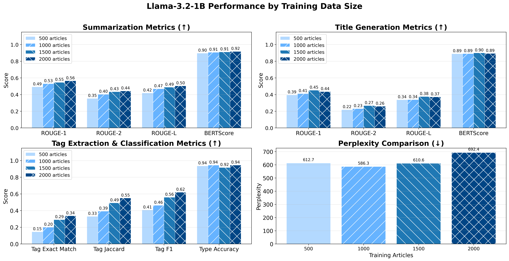
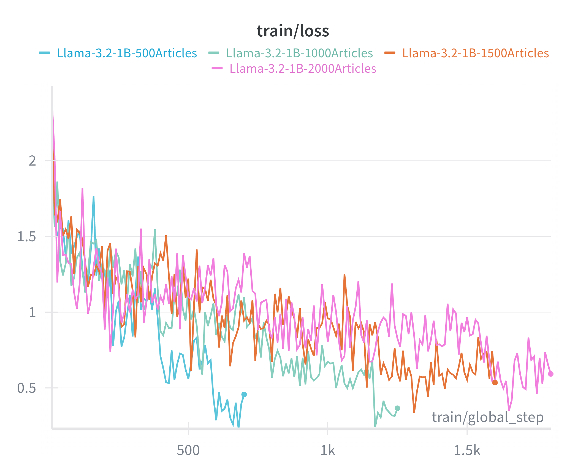
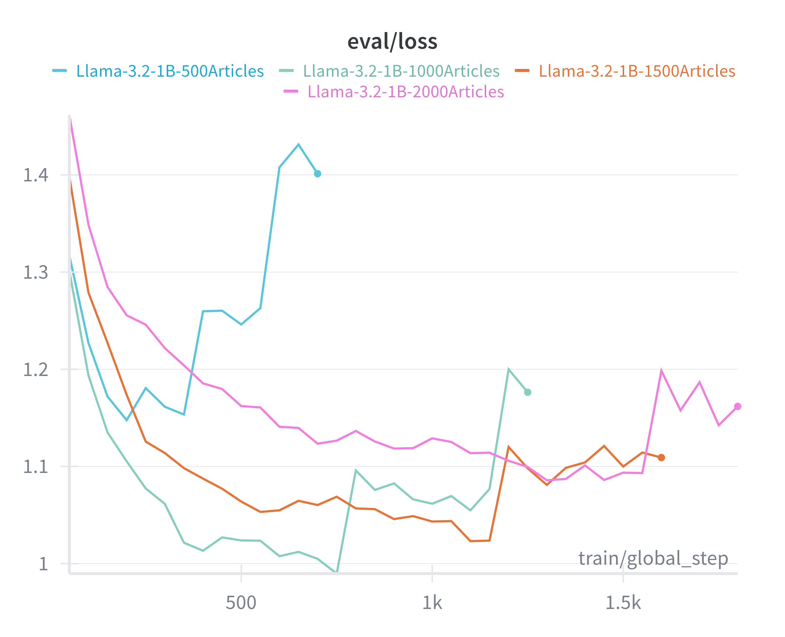

# 📊 ChatBMW Fine-tuning Results Summary

This document presents a comprehensive analysis of the fine-tuned Llama-3.2-1B model performance on BMW news article tasks.

---

## 📋 Table of Contents

- [Model Overview](#-model-overview)
- [Training Configuration](#-training-configuration)
- [Evaluation Summary](#-evaluation-summary)
- [Task-by-Task Analysis](#-task-by-task-analysis)
- [Key Improvements](#-key-improvements)
- [Qualitative Comparison](#-qualitative-comparison-sample-outputs)
- [Conclusions](#-conclusions)

---

## 🤖 Model Overview

| Property | Value |
|----------|-------|
| **Base Model** | `unsloth/Llama-3.2-1B-Instruct` |
| **Fine-tuning Method** | LoRA (Low-Rank Adaptation) |
| **Training Data** | 2,000 BMW news articles |
| **Test Samples** | 787 samples |
| **GPU** | NVIDIA GeForce RTX 5090 (31.3 GB VRAM) |


## 📊 Task-by-Task Analysis

### 1. 📝 Summarization (197 samples)

| Metric | Fine-tuned | Base | Change |
|--------|------------|------|--------|
| ROUGE-1 F1 | **0.5557** | 0.2350 | +0.3207 |
| ROUGE-2 F1 | **0.4463** | 0.1043 | +0.3420 |
| ROUGE-L F1 | **0.5005** | 0.1578 | +0.3427 |
| BERTScore F1 | **0.9127** | 0.8390 | +0.0737 |
| Avg Prediction Length | 43.9 words | 200.9 words | -157 words |
| Length Ratio | **1.20** | 6.18 | -4.98 |

**Key Findings:**
- The fine-tuned model produces **concise summaries** with appropriate length (~44 words vs reference ~45 words)
- Base model generates **overly verbose outputs** (201 words avg, 6x longer than expected)
- Dramatic improvement in n-gram overlap (+136% to +328%)
- High semantic similarity maintained (BERTScore > 0.91)

---

### 2. 📰 Title Generation (273 samples)

| Metric | Fine-tuned | Base | Change |
|--------|------------|------|--------|
| ROUGE-1 F1 | **0.6253** | 0.1078 | +0.5175 |
| ROUGE-2 F1 | **0.4856** | 0.0481 | +0.4375 |
| ROUGE-L F1 | **0.5628** | 0.0913 | +0.4715 |
| BERTScore F1 | **0.9283** | 0.8167 | +0.1116 |
| Avg Prediction Length | 10.6 words | 137.0 words | -126.4 words |
| Length Ratio | **0.99** | 20.02 | -19.03 |

**Key Findings:**
- **Most dramatic improvement** across all tasks
- Fine-tuned model produces **appropriate title lengths** (~11 words vs reference ~12 words)
- Base model outputs **lists of options** instead of single titles (137 words avg!)
- Near-perfect length ratio (0.99) indicates excellent format adherence

---

### 3. 🏷️ Tag Extraction (174 samples)

| Metric | Fine-tuned | Base | Change |
|--------|------------|------|--------|
| Exact Match | **0.3448** | 0.0000 | +0.3448 |
| Jaccard Similarity | **0.5584** | 0.0010 | +0.5574 |
| Precision | **0.6568** | 0.0015 | +0.6553 |
| Recall | **0.6603** | 0.0034 | +0.6569 |
| F1 Score | **0.6307** | 0.0018 | +0.6289 |

**Key Findings:**
- Base model **completely fails** at this task (essentially 0% accuracy)
- Fine-tuned model achieves **34.5% exact match** and **63% F1 score**
- Demonstrates the model learned the **specific output format** for BMW article tags
- Good balance between precision and recall (both ~66%)

---

### 4. 📂 Type Classification (143 samples)

| Metric | Fine-tuned | Base | Change |
|--------|------------|------|--------|
| Accuracy | **88.11%** | 0.00% | +88.11% |
| Correct Predictions | 126 | 0 | +126 |

**Class Distribution & Accuracy:**

| Class | Samples | Fine-tuned Accuracy | Base Accuracy |
|-------|---------|---------------------|---------------|
| Press Release | 135 | **88.9%** | 0% |
| Press Kit | 6 | **66.7%** | 0% |
| Speech | 2 | **100%** | 0% |

**Key Findings:**
- Base model cannot produce valid classification labels
- Fine-tuned model achieves **88% overall accuracy**
- Perfect accuracy on "Speech" category (though limited samples)
- Lower accuracy on "Press Kit" likely due to class imbalance (only 6 samples)

---

## 🎯 Key Improvements

### Performance Gains Summary

```
┌─────────────────────────────────────────────────────────────────┐
│                    IMPROVEMENT HIGHLIGHTS                        │
├─────────────────────────────────────────────────────────────────┤
│                                                                  │
│  📝 SUMMARIZATION                                                │
│     └── ROUGE-1: +136.5%  │  BERTScore: +8.8%                   │
│                                                                  │
│  📰 TITLE GENERATION                                             │
│     └── ROUGE-1: +480.0%  │  BERTScore: +13.7%                  │
│                                                                  │
│  🏷️ TAG EXTRACTION                                               │
│     └── F1: +34,939%  │  From 0% to 63%                         │
│                                                                  │
│  📂 TYPE CLASSIFICATION                                          │
│     └── Accuracy: From 0% to 88.11%                             │
│                                                                  │
│  📉 PERPLEXITY                                                   │
│     └── Reduced by 58.3% (743 → 310)                            │
│                                                                  │
└─────────────────────────────────────────────────────────────────┘
```

### Results Visualization


### Why Fine-tuning Worked

1. **Format Learning**: The model learned to produce outputs in the expected format (concise titles, comma-separated tags, single classification labels)

2. **Length Control**: Dramatic reduction in output verbosity - the fine-tuned model respects the expected output length

3. **Domain Adaptation**: The model learned BMW-specific terminology and article structure

4. **Task Understanding**: The base model often misunderstands the task (e.g., generating multiple title options instead of one)

---

## Comparsion by Data Size

We evaluated models fine-tuned on different training data sizes (500, 1000, 1500, and 2000 articles) to understand the relationship between data quantity and performance.



### Training & Evaluation Loss Curves





### Key Findings

**Training Loss Observations:**
- All configurations show a **steep initial decline** from ~2.0-2.3 to ~1.0-1.5 within the first few hundred steps
- Training loss continues to **decrease steadily** across all data sizes, converging to similar final values (~0.5-0.6)
- Larger datasets require **more training steps** but achieve comparable final training loss values
- The smooth, consistent decline indicates **stable optimization** without catastrophic learning issues

**Evaluation Loss Observations:**
- The **500-article model** exhibits high volatility with a notable spike (~1.4) around step 600-700, indicating **overfitting** on the smaller dataset
- The **1000-article model** shows moderate stability but eval loss increases after step 1k, suggesting **early signs of overfitting**
- The **2000-article model** shows a **gradual increase** in eval loss during later training stages (~1.15-1.2), potentially indicating diminishing returns

**Training Dynamics Insights:**
- **Smaller datasets (500)** are prone to overfitting despite lower training loss
- **Larger datasets (2000)** may not always yield better generalization - the gap between train and eval loss widens in later epochs
- The **U-shaped eval loss pattern** in smaller models is a classic overfitting indicator

| Task | Trend with More Data | Notes |
|------|---------------------|-------|
| **Summarization** | ↑ Improves | ROUGE-1: 0.49 → 0.56, BERTScore: 0.90 → 0.92 |
| **Title Generation** | ↑ Improves | ROUGE-1: 0.39 → 0.44, BERTScore: 0.89 → 0.89 |
| **Tag Extraction** | ↑ Improves | Exact Match: 0.15 → 0.34, F1: 0.41 → 0.62 |
| **Type Classification** | → Stable | Accuracy remains ~94% regardless of data size |
| **Perplexity** | ⚠️ Inconsistent | 612.7 → 586.3 → 610.6 → 692.4 |


1. **Summarization & Title Generation**: Show consistent improvement with more training data. ROUGE scores increase steadily across all metrics, indicating better text generation quality.

2. **Tag Extraction**: Shows the most significant improvement with data scaling. Tag Exact Match more than doubles from 0.15 (500 articles) to 0.34 (2000 articles), and Tag F1 improves from 0.41 to 0.62.

3. **Type Classification**: Already achieves high accuracy (~94%) even with 500 articles, suggesting this task may be relatively easier or requires less data to learn effectively.

4. **Perplexity**: Does not follow a clear trend - lower is better, but the values fluctuate (612.7 → 586.3 → 610.6 → 692.4). This unexpected behavior requires further investigation. Possible explanations include:
   - Less diversity in larger datasets creating more uncertainty
   - Potential overfitting or underfitting
   - The evaluation set may not be fully representative


- **More data generally leads to better performance** for text generation tasks (summarization, title generation) and extraction tasks (tag extraction)
- **Classification tasks** may plateau early and not benefit as much from additional data
- **Perplexity behavior** warrants further exploration to understand the underlying factors

---

## 📝 QUALITATIVE COMPARISON: Sample Outputs


### Example 1


📝 User Message:
Summarize the following BMW news article in a concise way.

There's something magical about waking up in Namibia, even more so when it's under the roar of lions, ready for battle - or at least, that's what it felt like listening to the nearly 80 boxer engines revving up as they emerged from the vall...

✅ Expected Output:
Recap of Day 2. Location: Spitzkoppe, Namibia Weather: Sunny, 12°C – 29 °C Course: 184km: Ai Aiba – Schwarze Spitzkoppe – Spitzkoppe Terrain types: Tarmac 0km, off-road 184km Tests: SP1: Flying Boxer, SP2: The SENA Rock Challenge Top three teams male: 1. South Africa, 2. Germany, 3. International Team Top three teams female: 1. Germany, Japan, 3. Benelux

🔵 Fine-tuned Model Output:
On 4th and 5th March 2024, riders from 9 countries took on the diverse landscapes of Namibia in the BMW Motorrad International GS Trophy 2024.

🟠 Base Model Output:
Here's a concise summary of the BMW news article:

**BMW R 1300 GS Adventure Bike Completes the 2024 GS Trophy in Namibia**

The BMW R 1300 GS Adventure bike has completed the 2024 GS Trophy, a prestigious motorcycle rally that takes riders through diverse terrain in Namibia. The bike completed the final leg of the rally on December 31, 2023, after a grueling journey covering over 1,000 kilometers.

**Key Highlights:**

* The bike completed the final leg of the GS Trophy on December 31, 2023, after a challenging journey through Namibia's rugged terrain.
* Riders completed the final leg in 3:33 hours, 45 minutes, and 33 seconds.
* The bike reached a top speed of 180 km/h and covered 400 km of the 1,000 km route.
* Riders also spotted wildlife, including rhinos, giraffes, and elephants, during the journey.

**Team Performance:**

The riders completed the GS Trophy with a combined total of 57 points, with Team South Africa finishing first. The riders also praised the bike's reliability and comfort, citing the Automated Shift Assistant system as a key factor in their success.

**Sustainability and Responsible Action:**

The BMW Group emphasized its commitment to sustainability and responsible action, stating that the success of the GS Trophy has been based on long-term thinking and responsible action. The company sets the course for the future, consistently making sustainability and efficient resource management central to its strategic direction.

**Analysis:** The fine-tuned model produces a concise one-sentence summary, while the base model generates an elaborate, structured response with fabricated details (hallucinations).

────────────────────────────────────────────────────────────────────────────────


### Example 2


📝 User Message:
Generate a concise and informative title for the following BMW news article.

Recap of Day 2. Location: Spitzkoppe, Namibia Weather: Sunny, 12°C – 29 °C Course: 184km: Ai Aiba – Schwarze Spitzkoppe – Spitzkoppe Terrain types: Tarmac 0km, off-road 184km Tests: SP1: Flying Boxer, SP2: The SENA Rock Ch...

✅ Expected Output:
BMW Motorrad International GS Trophy 2024 Namibia. Day 2. Into the heart of Namibia.

🔵 Fine-tuned Model Output:
BMW Motorrad International GS Trophy 2024 Namibia. Day 2.

🟠 Base Model Output:
Here are some concise and informative title options for the BMW news article:

1. "BMW Motorrad Introduces the GS Trophy: Day 2 of the 2024 Edition"
2. "Namibia's Hidden Gems: Day 2 Highlights of the BMW GS Trophy"
3. "Riding into the Heart of Namibia: BMW Motorrad's GS Trophy 2024"
4. "BMW GS Trophy 2024: Day 2 of Adventure in Namibia"
5. "The Ultimate Test of Endurance: BMW Motorrad's GS Trophy 2024"
6. "Namibia's Granite Peaks: BMW Motorrad's GS Trophy 2024 Day 2"
7. "Bike, Land, and Legend: BMW Motorrad's GS Trophy 2024 Day 2"
8. "The Adventure Begins: BMW Motorrad's GS Trophy 2024 Day 2 in Namibia"

Choose the one that best captures the essence of the article!

**Analysis:** The fine-tuned model outputs a single, appropriate title matching the expected format. The base model provides 8 options instead of one title, demonstrating it didn't understand the task requirements.

────────────────────────────────────────────────────────────────────────────────


### Example 3

📝 User Message:
Extract and list the key topics and categories for the following BMW news article.

Recap of Day 2. Location: Spitzkoppe, Namibia Weather: Sunny, 12°C – 29 °C Course: 184km: Ai Aiba – Schwarze Spitzkoppe – Spitzkoppe Terrain types: Tarmac 0km, off-road 184km Tests: SP1: Flying Boxer, SP2: The SENA R...

✅ Expected Output:
BMW Motorrad, Rider Training, Travel, Events

🔵 Fine-tuned Model Output:
BMW Motorrad, Rider Training, Travel, Events

🟠 Base Model Output:
Here are the key topics and themes extracted from the BMW News Article:

**Key Topics:**

1. Day 2 of the BMW Motorrad International GS Trophy 2024
2. Ai Aiba, Namibia
3. The Flying Boxer Special Challenge
4. The SENA Rock Challenge
5. The Road to Namibia

**Themes:**

1. Adventure Riding
2. Motorcycle Racing
3. Off-Road Riding
4. Wildlife Encounters
5. Cultural Significance of the Route
6. Sustainability and Environmental Awareness
7. Team Performance and Achievements
8. BMW Motorrad's Global Presence and Reach

These themes provide a comprehensive overview of the article, highlighting the excitement and challenges of the BMW Motorrad International GS Trophy 2024, as well as the company's commitment to adventure riding, sustainability, and cultural awareness.

**Analysis:** The fine-tuned model produces an **exact match** with the expected output in the correct comma-separated format. The base model completely fails the format, providing elaborate categories and themes instead of the expected tag list.

────────────────────────────────────────────────────────────────────────────────

---

## 🎓 Conclusions

### Key Takeaways

1. **Fine-tuning is Essential for Domain Tasks**: The base Llama-3.2-1B model, despite being instruction-tuned, cannot perform BMW-specific tasks effectively without fine-tuning.

2. **Format Learning**: The most significant improvement comes from teaching the model the expected output format - concise titles, comma-separated tags, and single-label classifications.

3. **Verbosity Control**: Fine-tuning dramatically reduces output length from excessive verbosity to appropriate conciseness.

4. **High Efficiency**: Using LoRA, only 1.79% of parameters were trained, making fine-tuning highly efficient.

5. **Strong Performance**: The fine-tuned model achieves:
   - **91.3% BERTScore** on summarization
   - **92.8% BERTScore** on title generation  
   - **63% F1** on tag extraction
   - **88% accuracy** on type classification

### Limitations 

- **Tag Extraction**: 34.5% exact match suggests room for improvement
- **Class Imbalance**: Limited samples for "Press Kit" and "Speech" categories
- **Perplexity**: Still relatively high (310) - could be improved with more data or larger models

---

## Future Considerations

- **Data augmentation**: Paraphrasing, back-translation
- **Multi-lingual**: BMW PressClub has regional variants
- **Larger models**: Scale to 3B/8B with quantization
- **RLHF/DPO**: Preference-based fine-tuning for quality
- **RAG integration**: Combine with retrieval for current news

---

*Report generated from evaluation on 787 test samples using Llama-3.2-1B fine-tuned on 2,000 BMW news articles.*
