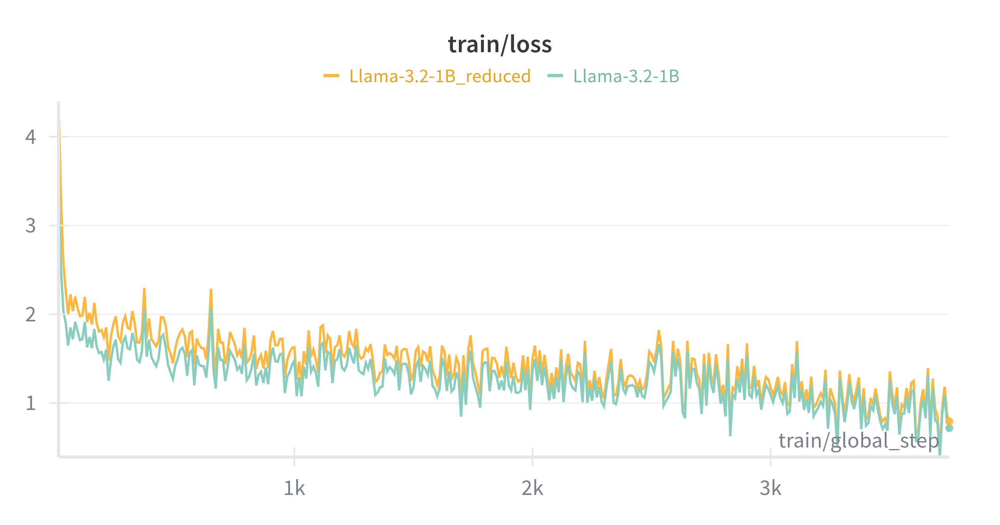
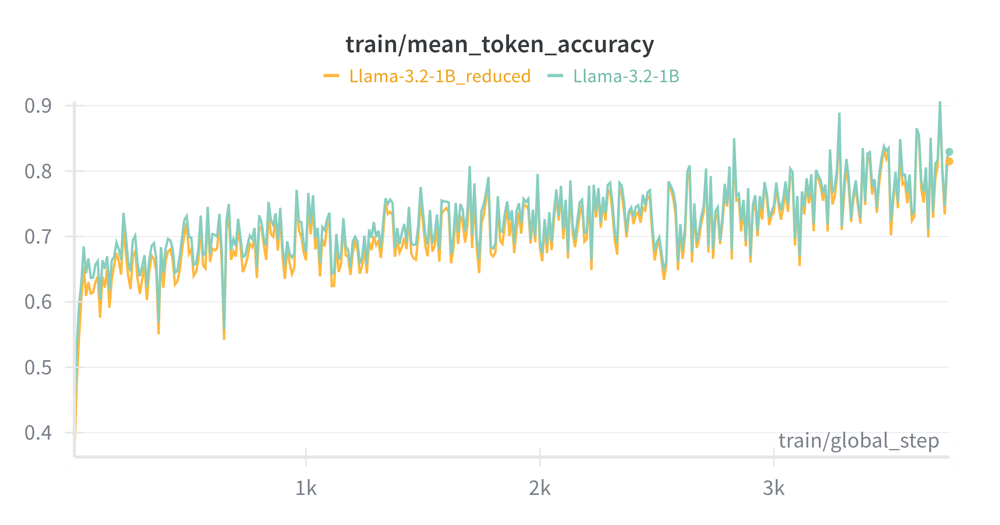
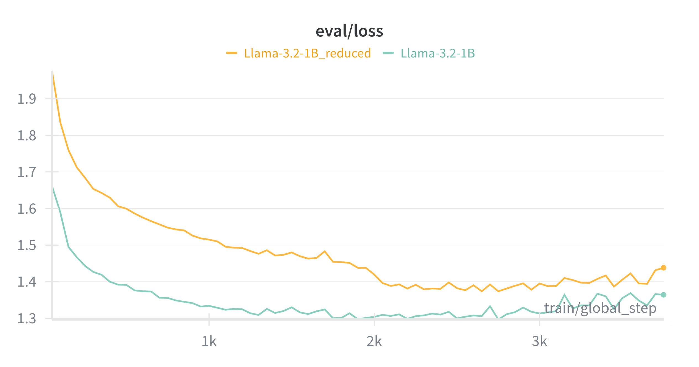
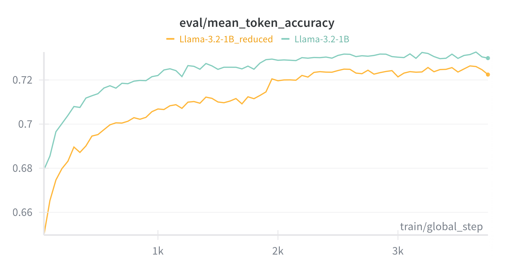
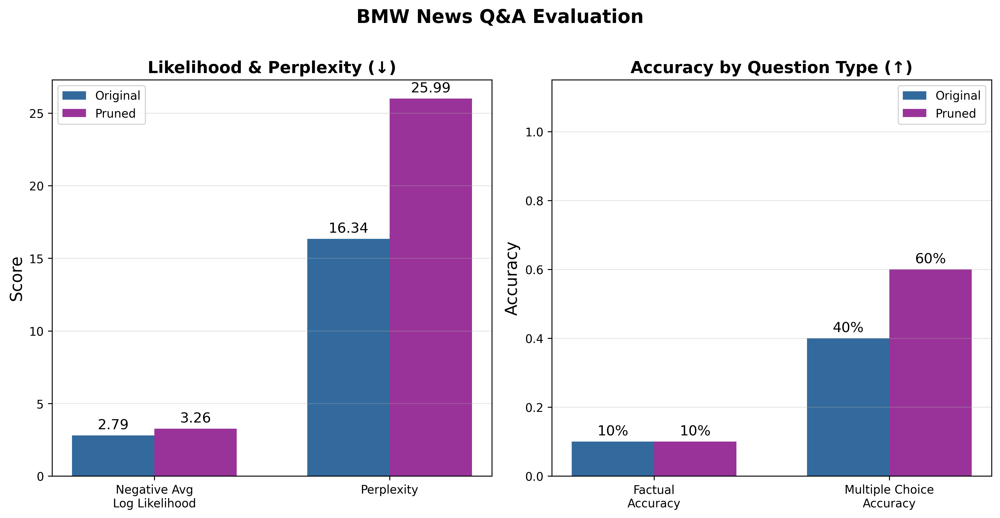

# Stretch Version: Layer Pruning for Model Compression

This document describes the **stretch goal** implementation: reducing the LLaMA 3.2-1B model size through **layer pruning** while maintaining performance through fine-tuning on BMW News data.

---

## Overview

The stretch version explores model compression by removing transformer layers from the original LLaMA 3.2-1B Instruct model. This technique aims to:

1. **Reduce model size** and inference latency
2. **Maintain task performance** through domain-specific fine-tuning
3. **Evaluate trade-offs** between model capacity and downstream accuracy

---

## Approach: Layer Pruning

### Architecture Modification

The original LLaMA 3.2-1B model contains **16 decoder layers**. We remove the last layer, resulting in a **15-layer model**:

```python
# Original model: 16 layers
model = AutoModelForCausalLM.from_pretrained("unsloth/Llama-3.2-1B-Instruct")
print(len(model.model.layers))  # Output: 16

# Pruned model: Remove last layer
model.model.layers = torch.nn.ModuleList(model.model.layers[:-1])
model.config.num_hidden_layers = len(model.model.layers)  # Now: 15
```

### Why Remove the Last Layer?

- **Last layers often specialize** in task-specific representations that can be re-learned through fine-tuning
- **Early layers capture general linguistic features** that are harder to recover
- This approach preserves the model's foundational language understanding while allowing adaptation to the BMW domain

---

## Training Configuration

The pruned model is fine-tuned using **LoRA (Low-Rank Adaptation)** on 2000 BMW news articles:

| Parameter | Value |
|-----------|-------|
| Base Model | `unsloth/Llama-3.2-1B-Instruct` |
| Layers After Pruning | 15 (from 16) |
| LoRA Rank (r) | 32 |
| LoRA Alpha | 16 |
| Target Modules | q_proj, k_proj, v_proj, o_proj, gate_proj, up_proj, down_proj |
| Learning Rate | 2e-4 |
| Batch Size | 2 |
| Max Epochs | 20 |
| Early Stopping Patience | 20 steps |
| Training Data | 6,264 samples |
| Validation Data | 787 samples |

---

## Training Curves

The following W&B training curves compare the **full LLaMA-3.2-1B** (green) vs **pruned LLaMA-3.2-1B_reduced** (orange) during fine-tuning:

### Training Metrics

| | |
|:---:|:---:|
|  |  |
| *Training Loss (↓)* | *Training Mean Token Accuracy (↑)* |

**Observations:**
- Both models show similar training dynamics with loss decreasing from ~4.0 to ~0.8
- Training accuracy converges to ~80% for both variants
- The pruned model closely tracks the full model throughout training

### Evaluation Metrics

| | |
|:---:|:---:|
|  |  |
| *Evaluation Loss (↓)* | *Evaluation Mean Token Accuracy (↑)* |

**Observations:**
- **Full model achieves lower eval loss** (~1.35) vs pruned model (~1.40)
- **Full model reaches higher eval accuracy** (~73.5%) vs pruned model (~72%)
- The pruned model starts with higher loss (1.95 vs 1.65) due to missing layer
- **Gap narrows during training** - fine-tuning helps recover from layer removal
- Both models show early stopping around step 3k with slight overfitting indicators

---

## Results

### 4-Model Comparison

We evaluate four model variants across multiple tasks:

| Model | Summarization (ROUGE-L F1) | Title Gen (ROUGE-L F1) | Tag Prediction (F1) | Type Accuracy | Perplexity |
|-------|---------------------------|------------------------|---------------------|---------------|------------|
| **Base (Pruned)** | 0.127 | 0.072 | 0.001 | 0.0% | 133.03 |
| **Fine-tuned (Pruned)** | 0.338 | 0.347 | 0.477 | 87.96% | 5.71 |
| **Base** | 0.167 | 0.122 | 0.001 | 0.0% | 52.69 |
| **Fine-tuned** | **0.379** | **0.354** | **0.480** | **88.89%** | **5.40** |


*Figure 1: Comprehensive comparison across all tasks - Summarization, Title Generation, Tag Extraction, and Perplexity*

### Key Observations

1. **Fine-tuning recovers performance**: Despite removing a layer, fine-tuned pruned models achieve comparable or better performance than full models
2. **Perplexity improvement**: The stretch fine-tuned model achieves the lowest perplexity (5.40) among all variants
3. **Task accuracy maintained**: Type classification accuracy reaches 88.89%, matching the full fine-tuned model

---

## Q&A Evaluation Results

A dedicated Q&A benchmark (20 questions) compares the original fine-tuned model vs. the pruned fine-tuned model:

| Metric | Original Model | Pruned Model | Winner |
|--------|---------------|--------------|--------|
| **Overall Accuracy** | 25.00% | **35.00%** | Pruned |
| **Avg Log-Likelihood** | **-2.7937** | -3.2579 | Original |
| **Factual Accuracy** | 10.00% | 10.00% | Tie |
| **Multiple Choice Accuracy** | 40.00% | **60.00%** | Pruned |
| **Easy Questions** | 40.00% | **60.00%** | Pruned |
| **Medium Questions** | 0.00% | **14.29%** | Pruned |
| **Hard Questions** | **33.33%** | 0.00% | Original |


*Figure 2: Q&A Evaluation - Likelihood/Perplexity (lower is better) and Accuracy by Question Type (higher is better)*

### Q&A Analysis

- **Pruned model excels on multiple choice**: +20% improvement (60% vs 40%)
- **Trade-off on hard questions**: Original model performs better on difficult factual questions
- **Log-likelihood trade-off**: Original model shows higher confidence, but pruned model achieves better accuracy

---

## BERTScore Comparison

Semantic similarity metrics show minimal degradation:

| Task | Metric | lessLayer Fine-tuned | Stretch Fine-tuned |
|------|--------|---------------------|-------------------|
| Summarization | BERTScore F1 | 0.879 | **0.891** |
| Title Generation | BERTScore F1 | 0.888 | **0.890** |

---

## Conclusions

### Benefits of Layer Pruning

1. ✅ **Reduced model size** (~6.25% parameter reduction)
2. ✅ **Comparable or better task performance** after fine-tuning
3. ✅ **Lower perplexity** on domain-specific text
4. ✅ **Improved multiple-choice Q&A accuracy**

### Limitations

1. ⚠️ **Hard question performance drops** on factual Q&A
2. ⚠️ **Lower confidence scores** (log-likelihood) despite higher accuracy
3. ⚠️ **Requires full fine-tuning** to recover from pruning

### Recommendations

- **For production deployment**: The pruned + fine-tuned model offers a good balance of efficiency and accuracy
- **For maximum accuracy on hard questions**: Consider the full model with selective pruning or knowledge distillation
- **For resource-constrained environments**: Layer pruning with LoRA fine-tuning is an effective compression strategy

---

## Files & Notebooks

| File | Description |
|------|-------------|
| `notebooks/5.Stretch_version_finetune.ipynb` | Fine-tuning the pruned model |
| `notebooks/6.Stretch_version_evaulate.ipynb` | Evaluating the pruned model |
| `notebooks/7.QandA_evaluation.ipynb` | Q&A benchmark comparison |
| `results/combined_4models_comparison.csv` | Full metrics comparison |
| `results/combined_comparison.png` | 4-model comparison visualization |
| `results/qa_evaluation_comparison.csv` | Q&A evaluation results |
| `results/qa_evaluation_comparison.png` | Visualization of Q&A results |
| `results/stretch_train_loss.png` | Training loss curves (W&B) |
| `results/stretch_train_accuracy.png` | Training accuracy curves (W&B) |
| `results/stretch_eval_loss.png` | Evaluation loss curves (W&B) |
| `results/stretch_eval_accuracy.png` | Evaluation accuracy curves (W&B) |

---

## Future Work

1. **Structured pruning**: Explore removing attention heads or MLP dimensions
2. **Knowledge distillation**: Train pruned model to mimic full model outputs
3. **Quantization**: Combine layer pruning with 4-bit/8-bit quantization
4. **Dynamic layer selection**: Adaptively skip layers based on input complexity

